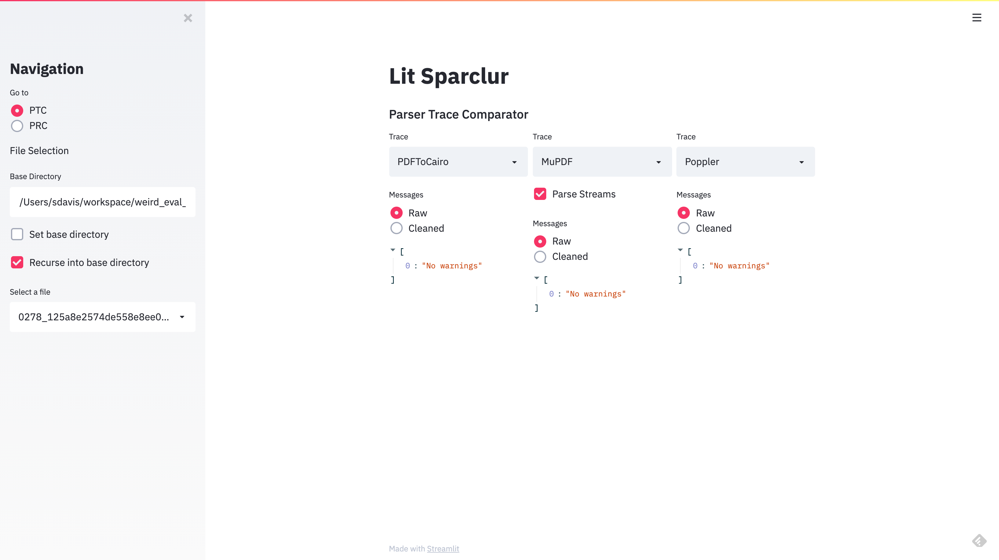
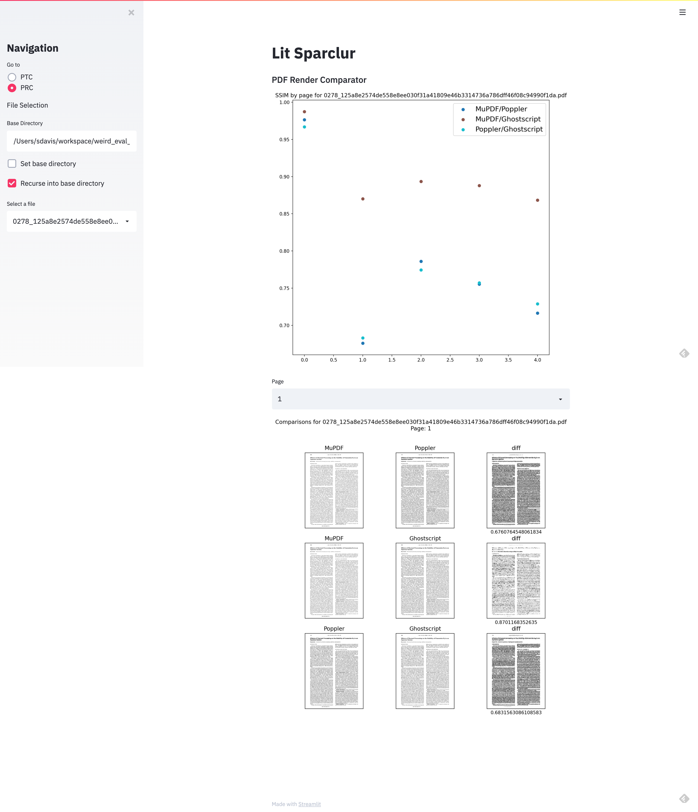
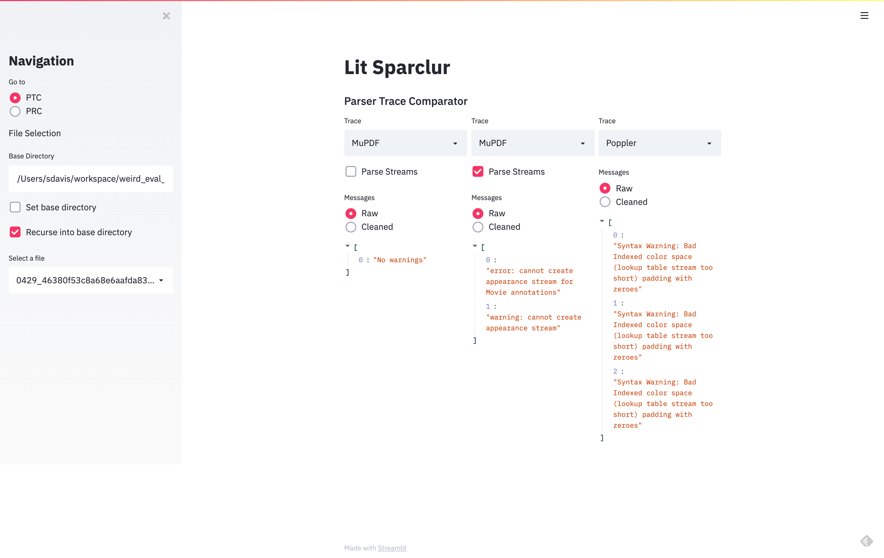

# SPARCLUR - Some PDF Analyzers and Renderer Comparators: LevelUp Research

SPARCLUR (Sparclur) is a collection of various wrappers for extant PDF 
parsers and/or renderers along with accompanying tools for comparing and analyzing the outputs from
these parsers. See it in action here: https://youtu.be/6I6E1N3CJzQ

## Installation

```buildoutcfg
pip install sparclur
```

## Contents
- [Parsers](#parsers)
  - [Arlington DOM Checker](#arlington-dom-checker)
  - [Ghostscript](#ghostscript)
  - [MuPDF](#mupdf)
  - [PDFCPU](#pdfcpu)
  - [PDFium](#pdfium)
  - [PDFMiner](#pdfminer)
  - [Poppler](#poppler)
  - [QPDF](#qpdf)
  - [XPDF](#xpdf)
- [Config](#config)
- [Tools](#tools)
  - [Parser Wrappers](#parser-wrappers)
  - [Parser Trace Comparator](#parser-trace-comparator-ptc)
  - [PDF Renderer Comparator](#pdf-renderer-comparator-prc)
  - [PDF Text Comparator](#pdf-text-comparator-pxc)
  - [Spotlight](#spotlight)
  - [Roll Back](#roll-back)
  - [Detect Chaos](#detect-chaos)
  - [Highlight](#hightlight)
  - [Astrotruther](#astrotruther)
- [Streamlit Interface](#streamlit-interface)
- [Acknowledgements](#acknowledgements)


## Parsers
The following parsers need to either be installed or the binaries need to be built and accessible to fully leverage Sparclur.

### Arlington DOM Checker
The repo should be cloned and instructions for building the TestGrammar tool should be followed. SPARCLUR needs to be
pointed to the top-level directory of the cloned repo to access the DOM files and the TestGrammar tool.

https://github.com/pdf-association/arlington-pdf-model

### Ghostscript
Ghostscript needs to be installed using your preferred package manager with the `gs` command linked in your `PATH`, or 
the binary can be built and referenced at run-time within SPARCLUR.

https://www.ghostscript.com/

### MuPDF
MuPDF requires the binary installed or built as well as the Python wrapper package PyMuPDF.

https://mupdf.com/

https://pymupdf.readthedocs.io/en/latest/

### PDFCPU
PDFCPU is a Go based PDF processor. So both Go and PDFCPU will need to be installed/built. Binary can go into the `PATH`,
config, or entered at run-time.

https://pdfcpu.io/

### PDFium
Google's PDF rendering software. This is accessed using the pypdfium2 package.

https://pdfium.googlesource.com/pdfium/

https://github.com/pypdfium2-team/pypdfium2

### PDFMiner
PDFMiner is a Python based parser. The package needs to be installed into the working environment.

https://pdfminersix.readthedocs.io/en/latest/

### Poppler
Poppler and XPDF have binary name collisions, so only one can be referenced in `PATH`. The binary can be set in the
SPARCLUR config or at class instantiation.

https://poppler.freedesktop.org/

### QPDF
QPDF needs to be built/installed and the binary can be added to `PATH` or can be set in the config or
at run-time.

https://qpdf.sourceforge.io/

### XPDF
Poppler and XPDF have binary name collisions, so only one can be referenced in `PATH`. The binary can be set in the
SPARCLUR config or at class instantiation.

https://www.xpdfreader.com/

## Config
A sparclur.yaml file can be set in the top-level SPARCLUR folder if you are running the code cloned from GitHub. Parameters for the various parser classes can
be set, such as binary paths and other default values. See the `examples` directory for an example yaml file. If Sparclur
has been installed from PyPi, the `get_config` and `update_config` methods in the `utils` directory can be used to
view and update the current global config. The `update_config` just takes a dictionary of the values to be updated. The yaml can also be directly edited in either the system/virtual environment `etc` folder
or the users `.local` folder if installed at the user level.

## Tools
See the `examples` directory for Jupyter noteboooks showcasing the following tools.

### Parser Wrappers
SPARCLUR's extensible parser wrapper API's provide methods for:
* Document Rendering
* Text Extraction
* Trace message collection and normalization
* Document reforging for document cleaning and recovery
* Information extraction 
  * Font information
  * Object keys and values
  * Image data

### Parser Trace Comparator (PTC)
Gather and normalize warning and error messages from extant parsers.

### PDF Renderer Comparator (PRC)
The PRC compares different renderers over the same documents and can also be used
to visualize the differences and produce a similarity metric.

### PDF Text Comparator (PXC)
API's for extracting and comparing text between parsers.

### Spotlight
Runs all available API's for a parser and creates the reforges of the document. Signatures are generated for the
reforges and the original and compared to produce a similarity score between documents over each parser.
All of these results are collected for analysis.

### Roll Back
An incremental update tool, that detects incremental updates and provides an API to pass a specific update
into SPARCLUR parsers or save it to disk. It also does some text and rendering comparisons between consecutive versions
and returns plots of these metrics.

### Detect Chaos
Check documents for non-deterministic behavior within the SPARCLUR-wrapped parsers.

### Highlight
This tool has a very specific use case by analyzing explicitly modified PDF's with their original file in
order to find rendering differentials introduced by the modification.

### Astrotruther
Another specialized tool. This trains models for classifying the validity of PDF's using the 
trace messages from the parsers. This requires a labeled training set.

## Streamlit Interface

Running light_the_sparclur.sh will launch a Streamlit web app that will provide an interface for 
exploring PDF's using the PTC and PRC.




# Acknowledgements

This material is based upon work supported by the Defense Advanced Research 
Projects Agency (DARPA) under Contract No. HR0011-18-S-0054. Any opinions, 
findings and conclusions or recommendations expressed in this material are 
those of the author(s) and do not necessarily reflect the views of the 
Defense Advanced Research Projects Agency (DARPA).

Distribution Statement "A" (Approved for Public Release, Distribution Unlimited).

# Contributors
- Shawn Davis
- Dan Becker
- John Kansky
- J. Wilburn
- James Devens
- Emma Meno
- Liz Parker
- Peter Wyatt
- Tim Allison
