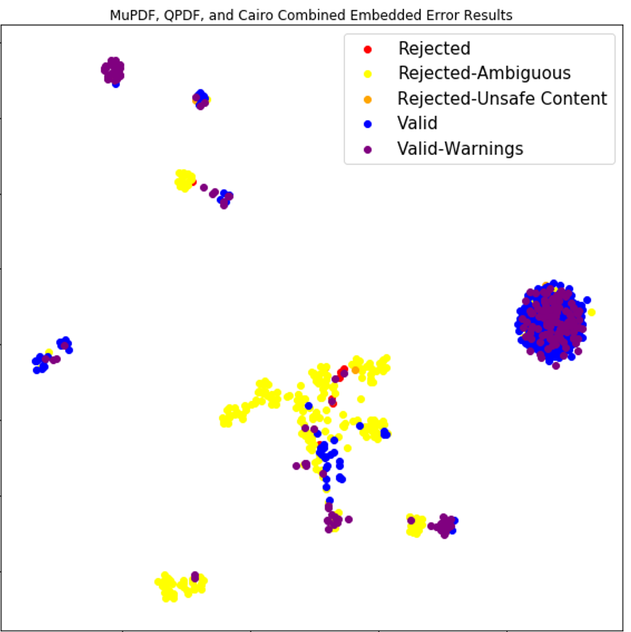

# SPARCLUR - Some PDF Analyzers and Renderer Comparators: LevelUp Research

SPARCLUR (Sparclur) is a a collection of various wrappers for extant PDF 
parsers and renderers and tools for comparing and analyzing the outputs from
these parsers.

## Parsers
* MuPDF
* QPDF
* Poppler (pdftoppm and pdftocairo)
* Ghostscript

## Tools
## Parser Trace Comparator (PTC)
### PDF Classifier
Train and apply classifiers using PDF parser error and warning messages as
classification features.

### PDF Embedding
Embed PDF's into a vector space using parser error and warning messages. The
technique utilizes FastMap[1](#f1) to project the PDF's into
a vector space based on a given distance metric between the collections of messages
for each document.

Here's a UMAP reduction of an embedding of 1000 PDF's using MuPDF, QPDF, and pdftocairo
messages.

## PDF Renderer Comparator (PRC)

The PRC compares different renderers over the same documents and can also be used
to visualize the differences and produce a similarity metric. The rendered image can also 
be run through Optical Character Recognition (OCR) to compare the rendered text with the extracted
text from something like pdftotext.
# Acknowledgements

This material is based upon work supported by the Defense Advanced Research 
Projects Agency (DARPA) under Contract No. HR0011-19-C-0076. Any opinions, 
findings and conclusions or recommendations expressed in this material are 
those of the author(s) and do not necessarily reflect the views of the 
Defense Advanced Research Projects Agency (DARPA).

#References
<b id="f1">1</b> Proceedings of the 1995 ACM SIGMOD international conference on Management of data  - SIGMOD  ’95. (1995). doi:10.1145/223784 [↩](#a1)