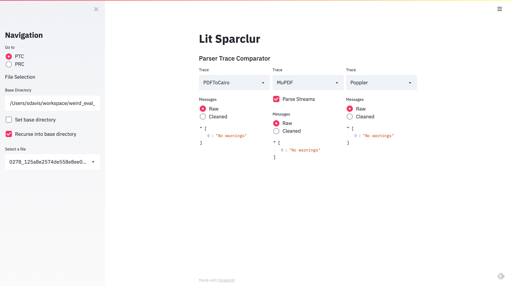
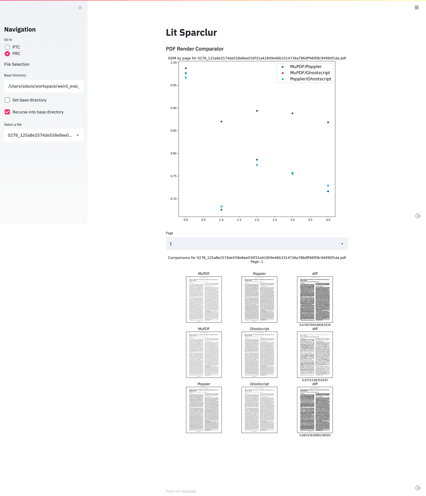
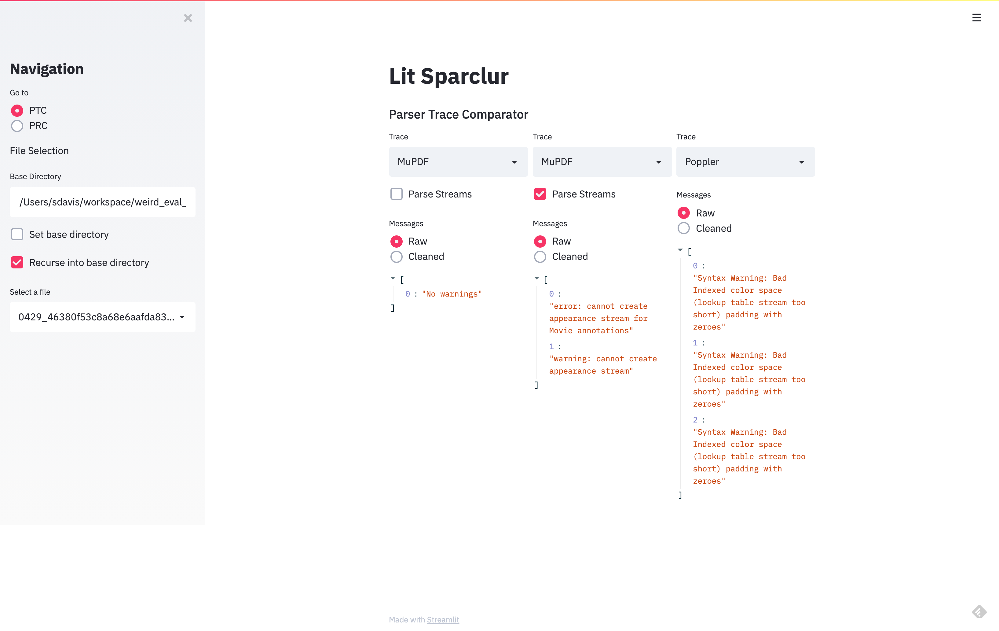

# SPARCLUR - Some PDF Analyzers and Renderer Comparators: LevelUp Research

SPARCLUR is a collection of wrappers around PDF parsers and renderers, plus
tools for comparing and analyzing their output. It is useful for inspecting
validity, rendering, text extraction, parser traces, incremental updates, and
parser repeatability.

API documentation is published at [Read the Docs](https://sparclur.readthedocs.io/).
The notebooks in [`examples`](examples) provide runnable, end-to-end examples.

See it in action here: https://youtu.be/6I6E1N3CJzQ

## Installation

```bash
pip install sparclur
```

SPARCLUR supports Python 3.10 and newer. The parser wrappers may additionally
need their respective command-line tools installed; see [Parsers](#parsers).

The Python-backed parser adapters and Streamlit interface are intentionally
optional. Install only what you plan to use:

```bash
pip install "sparclur[mupdf]"             # PyMuPDF adapter
pip install "sparclur[pdfium]"            # PDFium adapter
pip install "sparclur[pdfminer]"          # PDFMiner adapter
pip install "sparclur[ui,mupdf,pdfium]"   # UI plus common renderers
```

For local development, create an environment and install the development extra:

```bash
python -m venv .venv
.venv/bin/python -m pip install -e ".[dev]"
```

## Contents
- [Parsers](#parsers)
  - [Arlington DOM Checker](#arlington-dom-checker)
  - [Ghostscript](#ghostscript)
  - [MuPDF](#mupdf)
  - [PDFCPU](#pdfcpu)
  - [PDFium](#pdfium)
  - [PDFMiner](#pdfminer)
  - [Poppler](#poppler)
  - [QPDF](#qpdf)
  - [XPDF](#xpdf)
- [Config](#config)
- [Tools](#tools)
  - [Parser Wrappers](#parser-wrappers)
  - [Parser Trace Comparator](#parser-trace-comparator-ptc)
  - [PDF Renderer Comparator](#pdf-renderer-comparator-prc)
  - [PDF Text Comparator](#pdf-text-comparator-pxc)
  - [Spotlight](#spotlight)
  - [Roll Back](#roll-back)
  - [Detect Chaos](#detect-chaos)
  - [Highlight](#highlight)
  - [Floodlight](#floodlight)
  - [Astrotruther](#astrotruther)
- [Report generation](#report-generation)
- [Streamlit Interface](#streamlit-interface)
- [Acknowledgements](#acknowledgements)


## Parsers
Parser availability is discovered at runtime. A parser can be made available by
installing its Python extra, putting its command-line tool on `PATH`, or setting
its binary location in [configuration](#config). The interface selects only
parsers that are currently available by default.

### Arlington DOM Checker
Clone the repository and build its `TestGrammar` tool. Point SPARCLUR at the
top-level clone directory so it can locate both the DOM files and executable.

https://github.com/pdf-association/arlington-pdf-model

### Ghostscript
Install Ghostscript with your preferred package manager and expose `gs` on
`PATH`, or configure its executable path.

https://www.ghostscript.com/

### MuPDF
Install the PyMuPDF-backed adapter with `pip install "sparclur[mupdf]"`. The `mutool` binary is additionally required
for MuPDF trace collection and reforging; simple rendering and text extraction
only require the optional Python package.

https://mupdf.com/

https://pymupdf.readthedocs.io/en/latest/

### PDFCPU
PDFCPU is a Go-based PDF processor. Install or build PDFCPU and make its binary
available through `PATH`, configuration, or parser construction.

https://pdfcpu.io/

### PDFium
Google's PDF rendering software. Install its adapter with `pip install "sparclur[pdfium]"`.

https://pdfium.googlesource.com/pdfium/

https://github.com/pypdfium2-team/pypdfium2

### PDFMiner
PDFMiner is a Python-based parser. Install its adapter with `pip install "sparclur[pdfminer]"`.

https://pdfminersix.readthedocs.io/en/latest/

### Poppler
Poppler and XPDF can have binary-name collisions. Configure the selected tool's
path explicitly if both are installed.

https://poppler.freedesktop.org/

### QPDF
Install QPDF and add its binary to `PATH`, configure it, or supply it at
construction time.

https://qpdf.sourceforge.io/

### XPDF
Poppler and XPDF can have binary-name collisions. Configure the selected tool's
path explicitly if both are installed.

https://www.xpdfreader.com/

## Config
SPARCLUR reads YAML defaults for parser classes, such as binary paths, timeouts,
and render settings. Use [`examples/sparclur.yaml`](examples/sparclur.yaml) as a
reference. The normal editable file is available from Python:

```python
from sparclur.utils import get_config, get_config_path, update_config

print(get_config_path())
update_config({"Poppler": {"binary_path": "/path/to/poppler/bin"}})
print(get_config())
```

`update_config()` always writes to this user-owned file. It uses the platform-standard per-user configuration directory
(`~/Library/Application Support/sparclur/sparclur.yaml` on macOS) and creates parent directories as needed. Set
`SPARCLUR_CONFIG=/path/to/sparclur.yaml` to use an explicit file instead.

Configuration is layered from an environment/virtual-environment file, a checkout-local `sparclur.yaml`, legacy user
configuration, then the user-owned file. Later layers override earlier values without discarding unrelated parser
settings. The packaged YAML remains a template so its example paths are never applied automatically. Malformed YAML
produces a clear configuration error instead of silently falling back to defaults.

For a project-specific or shared configuration file, set `SPARCLUR_CONFIG` to
its path before starting Python or the UI. Use `update_config()` for personal
settings; it safely merges just the values supplied into the user-owned YAML.

## Tools
See the [`examples`](examples) directory for Jupyter notebooks that showcase
the following tools.

### Parser Wrappers
SPARCLUR's extensible parser wrapper APIs support:

* Document rendering
* Text extraction
* Trace message collection and normalization
* Document reforging for cleaning and recovery
* Font, object, and image-data extraction

### Parser Trace Comparator (PTC)
Gather and normalize warning and error messages from extant parsers.

### PDF Renderer Comparator (PRC)
The PRC compares different renderers over the same documents and can also be used
to visualize the differences and produce a similarity metric.

### PDF Text Comparator (PXC)
APIs for extracting and comparing text between parsers.

### Spotlight
Runs selected available capabilities for each parser and creates document
reforges. It records validity classifications and similarities across the
original and reforged versions, with tabular, heatmap, and interactive sunburst
reports.

### Roll Back
Detects incremental updates and exposes or saves any specific version. It also
compares text and rendered output between consecutive versions and returns
plots of those metrics.

### Detect Chaos
Repeats parser operations and reports evidence of nondeterministic behavior.
It is a screen rather than a proof: a clean run means no difference was
observed in the requested comparisons.

### Highlight
Analyzes explicitly modified PDFs alongside their known originals to find
rendering differences introduced by the modification. It requires a genuine
original-to-modified mapping.

### Floodlight
Runs a collection of parsers over PDFs and produces a flat, analysis-ready
record of their parser-level results.

### Astrotruther
Trains models to classify PDF validity from normalized parser traces. It
requires a labeled training set.

## Report generation

Native report generation creates a readable HTML dossier together with an
evidence bundle containing CSV and JSON tables, image evidence, and a manifest
of the source document and analysis options. It does not require Pweave or an
IPython kernel.

```python
from sparclur import DocumentReport

report = DocumentReport(
    "sample.pdf",
    parsers=["Ghostscript", "MuPDF", "Poppler", "PDFium"],
)
report.write_bundle("out/sample-report")
```

The dossier includes parser validity, normalized traces (PTC), text-comparison
data (PXC), renderer-comparison data and figures (PRC), and an extracted
predecessor when incremental updates are present. Use `BatchReport` to produce
a triage index with one evidence dossier per PDF. `SparclurReport` remains as a
compatibility facade; its `generate_report()` method now creates the native
HTML bundle.

## Streamlit Interface

### PyPI installation

Install the optional UI dependencies and run the packaged command:

```bash
pip install "sparclur[ui]"
sparclur-ui
```

Add a parser adapter as needed, for example `pip install "sparclur[ui,mupdf,pdfium]"`.

The command launches a Streamlit web app for exploring uploaded PDFs with the
PTC, PRC, PXC, Metadata, and Raw views. It accepts standard Streamlit options,
such as `sparclur-ui --server.port 8501`. In PRC, choose renderer pairs and
press **Refresh comparison** when ready; pair-selection changes do not rerun
the comparison immediately.

### Source checkout

Clone the repository, create and activate a virtual environment, then install the UI extra:

```bash
git clone https://github.com/levelupresearch/sparclur.git
cd sparclur
python -m venv .venv
source .venv/bin/activate
python -m pip install -e ".[ui]"
./light_the_sparclur.sh
```

The checkout launcher starts the same Streamlit interface using the activated environment.




# Acknowledgements

This material is based upon work supported by the Defense Advanced Research 
Projects Agency (DARPA) under Contract No. HR0011-18-S-0054. Any opinions, 
findings and conclusions or recommendations expressed in this material are 
those of the author(s) and do not necessarily reflect the views of the 
Defense Advanced Research Projects Agency (DARPA).

Distribution Statement "A" (Approved for Public Release, Distribution Unlimited).

# Contributors
- Shawn Davis
- Dan Becker
- John Kansky
- J. Wilburn
- James Devens
- Emma Meno
- Liz Parker
- Peter Wyatt
- Tim Allison
